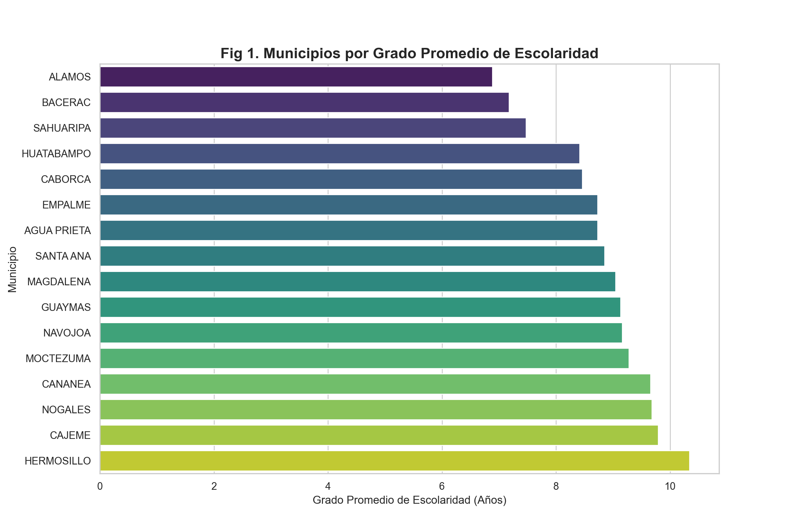
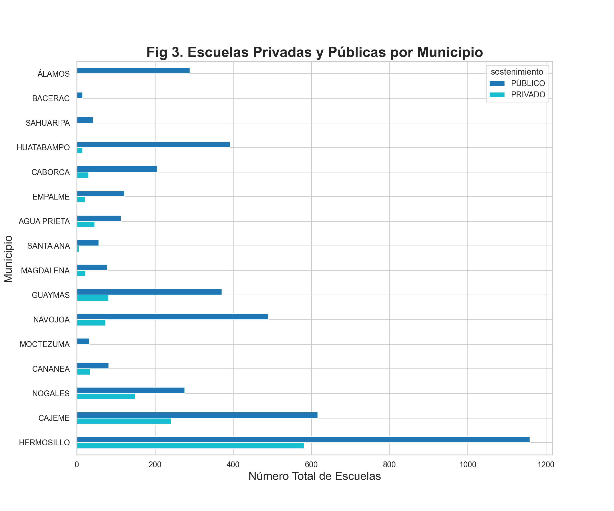
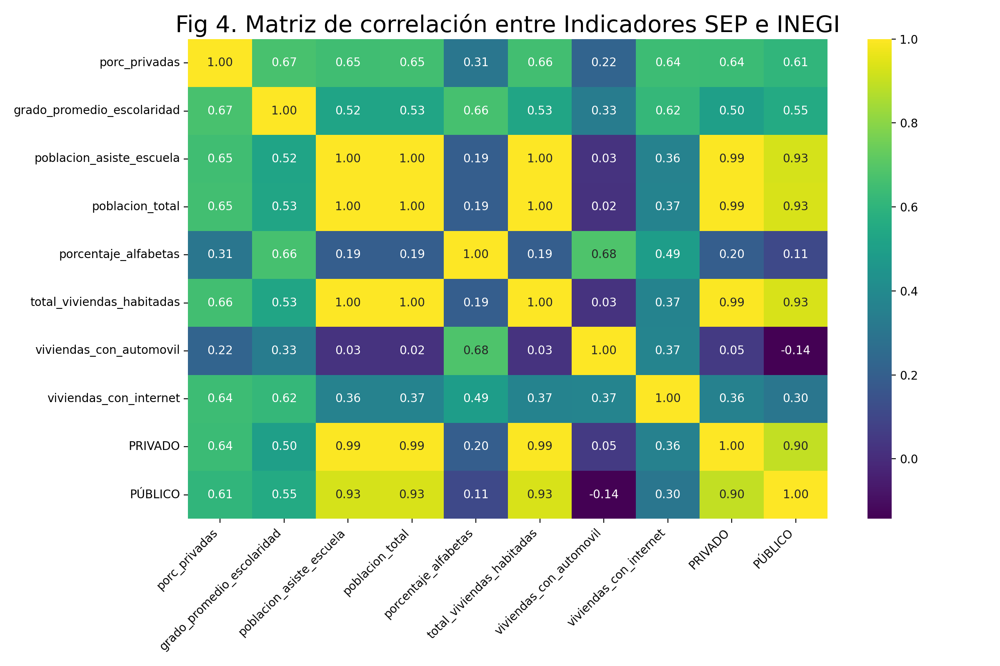
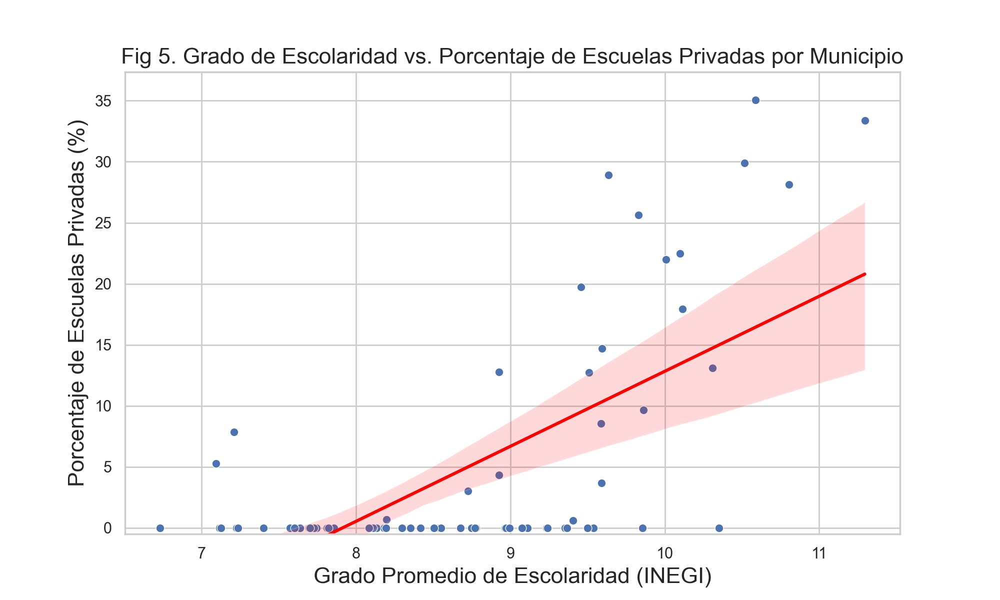
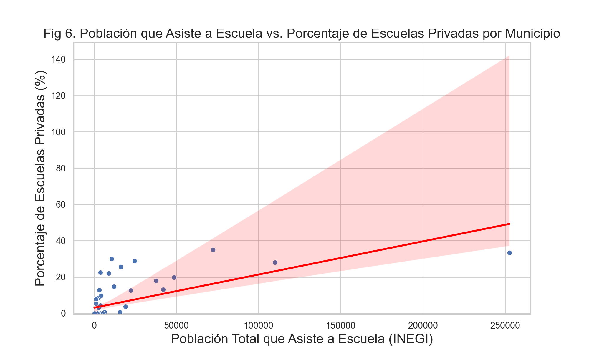
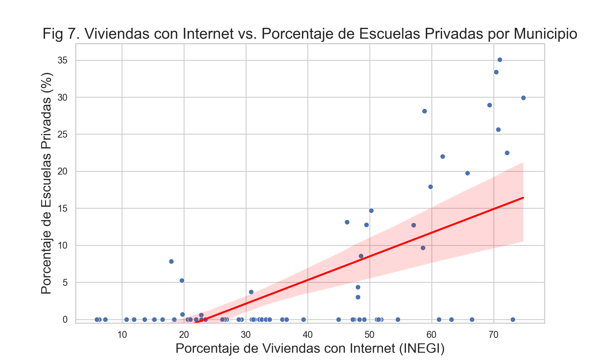
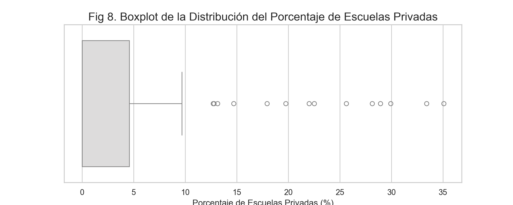
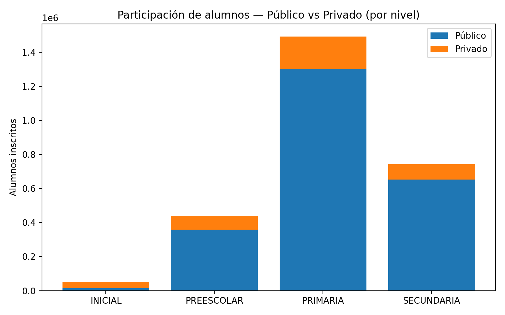
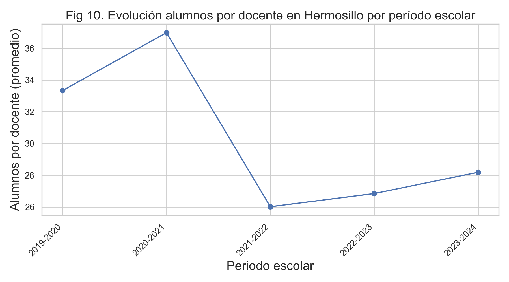
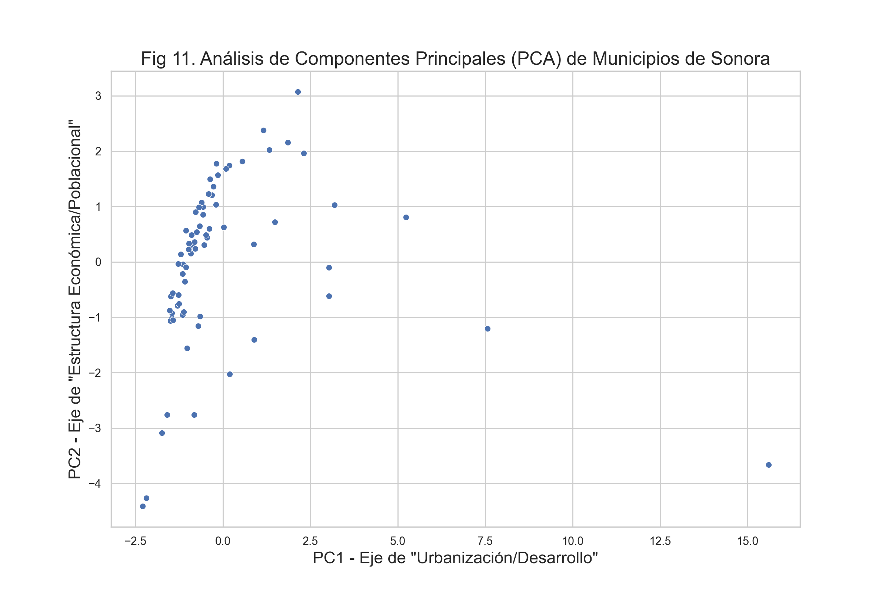

# Análisis de la Brecha Educativa en Sonora: Correlación entre Matrícula y Factores Socioeconómicos

## Integrantes
* Javier Alejandro Alonso Mozqueda
* Jesús Antonio Flores Briones
* Brayan Alexis Ramírez Camacho

---

## Resumen
Este análisis confirma que la brecha educativa en Sonora es un claro reflejo de su profunda división socioeconómica. Cruzando datos de matrícula (**SEP, 2019-2023**) con indicadores del Censo (**INEGI, 2020**), encontramos que la oferta de escuelas privadas es casi inexistente en la mayoría de los municipios; la mediana del porcentaje de escuelas privadas en el estado es 0%. El análisis de correlación identifica al grado promedio de escolaridad (**r=0.67**) y al porcentaje de viviendas con internet (**r=0.64**) como los predictores más fuertes de esta brecha. Finalmente, un análisis PCA confirma que Hermosillo es un 'outlier' de desarrollo que concentra la oferta educativa privada, separándose radicalmente del resto de los municipios.

## Contexto y Hallazgos Socioeconómicos

Este análisis se realizó con la información recopilada de dos fuentes de datos oficiales: las estadísticas de matrícula escolar y personal docente por nivel y sector (**Público/Privado**) del Formato 911 de la Secretaría de Educación Pública (**SEP**) y de indicadores socioeconómicos del Censo 2020 del **INEGI**.

De acuerdo a indicadores del INEGI, en Sonora existe una brecha de más de 5 años de escolaridad entre sus municipios. Mientras que en la capital, Hermosillo, el adulto promedio tiene mas de un un año de Preparatoria cursado (**~10.3 años**), en municipios más rurales como Álamos, el promedio es de apenas **~6.8 años** (Fig 1.). Esto significa que el adulto promedio en esas zonas solo completó su educación Primaria. La discrepancia se aprecia en la oferta educativa (Fig 2.): los municipios con mayor escolaridad concentran la gran mayoría de escuelas privadas, mientras que las zonas con mayor rezago dependen casi exclusivamente de la oferta pública.

Realizando un conteo de las escuelas activas en estos municipios (Fig 3.) es evidente que los municipios que presentan un mayor grado de escolaridad es aquel donde se encuentra un mayor número de escuelas privadas registradas. Sin embargo es necesario ver la correlación que puede existir entre ambas variables.

## Análisis de Correlación

En este estudio se tomaron en cuenta diferentes indicadores del INEGI, entre ellas el **Grado Promedio de Escolaridad** que se vio anteriormente; sin embargo, se consideraron otros indicadores que pudieran mostrar una correlación directa con el número de escuelas privadas registradas en un municipio. Entre dichos indicadores adicionales se encuentran: **La población total del municipio**, **la población que asiste a la escuela**, el **porcentaje de personas alfabetas**, el **total de viviendas habitadas**, las **viviendas que cuentan con automóvil** y las **viviendas que cuentan con internet**. La correlación entre dichos indicadores se muestra in la siguiente figura (Fig 4.):

La imagen muestra una correlación positiva entre el porcentaje de escuelas privadas por municipio (**porc_privadas**) y los indicadores considerados del INEGI. El factor más determinante fue el Grado Promedio de Escolaridad (**r=0.67**), seguido de cerca por la población que asiste a la escuela (**r=0.65**) y las viviendas que cuentan con internet (**r=0.64**). A continuación se muestra cada gráfica correspondiente a dicha correlación (**Fig 5.**, **Fig 6.** y **Fig 7.**):

## Análisis de Distribución y Anomalías

El análisis también muestra un número significativo de municipios donde se reportan cero escuelas privadas. Este hallazgo sugiere que la oferta de educación privada opera como un servicio que requiere una demanda local suficiente para ser sostenible. En los municipios donde los indicadores socioeconómicos son más bajos, esta demanda no se alcanza. Como resultado, en estas comunidades, el sistema público funge como el proveedor educativo principal y único, garantizando el acceso a la educación.

En la anterior imagen (**Fig 8.**) se puede apreciar de manera contundente la situación en educación en la que se encuentran los municipios en Sonora. La gráfica muestra que la mediana del porcentaje de las escuelas privadas se sitúa en **0%**. Esto confirma que al menos la mitad de todos los municipios del estado no tienen ninguna escuela privada. El tercer cuantil está ubicado en la parte baja de la gráfica, lo que indica que la mayoría tiene un bajo número de escuelas privadas, de manera que los “**outliers**” son aquellos que en el análisis de correlación (**Fig 5.**) se identificaron como los de mayor escolaridad y desarrollo.

## Hallazgos Adicionales

Como información complementaria a este análisis se muestran dos imágenes (**Fig 9.** y **Fig 10.**):

La **Fig 9.** muestra la participación de estudiantes inscritos en los diferentes niveles de educación básica, diferenciado por educación pública y privada, donde se aprecia que existe un mayor número de escuelas de nivel Primaria privadas que en los otros niveles educativos.

La **Fig 10**. muestra la evolución de los estudiantes (en promedio) que un docente ha tenido en su aula cada período escolar en Hermosillo. En esta gráfica vemos un descenso de 10 alumnos probablemente provocado por la pandemia por COVID-19, que generó la baja de alumnos asistiendo a la escuela y ha incrementado una pluralidad de problemáticas en el actual alumno.

Adicionalmente, el análisis de reducción de dimensionalidad (**PCA**) (**Fig 11**.) nos muestra que el municipio de Hermosillo es un 'outlier' estadístico, radicalmente distinto al resto del estado en términos de desarrollo, población y escolaridad. El resto de los municipios se agrupan en una nube de gran tamaño, indicando que son más similares entre ellos que con la capital. Esto nos confirma que el estado de Sonora se divide en realidades socioeconómicas distintas y explica uno de los motivos por los que la oferta educativa privada se concentra casi exclusivamente en Hermosillo y en otros pocos municipios del estado. Esta información es útil para la concientización sobre la brecha que existe entre los municipios, no solo educativa, sino también en otros aspectos económicos.

## Conclusión

Este análisis exploratorio de los datos confirma la hipótesis, existe una brecha educativa en Sonora y está ligada a la división socioeconómica. Hermosillo actúa como un dato anómalo de desarrollo que concentra la oferta educativa privada. Sin embargo, el estudio da espacio a preguntas más profundas para el modelado de los datos, ¿El grado de escolaridad es el verdadero indicador para urbanización y riqueza educativa en un municipio? ¿Existe algún otro indicador que pueda ser de utilidad para complementar este análisis?